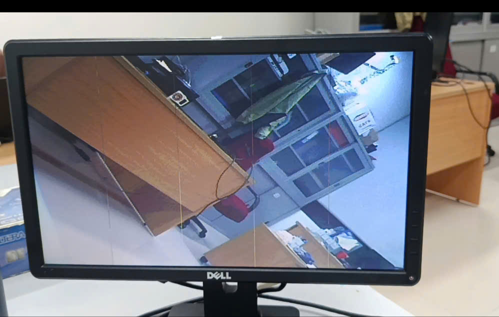

# CHẶNG 5: HÀNH TRÌNH TÌM DIỆT BUG SỌC DỌC KINH ĐIỂN - KHI KỸ SƯ ÉP PHẦN CỨNG LÊN TIẾNG

**Tài liệu Phân tích Kỹ thuật (Technical Post-Mortem Report)**
*Dự án: Hệ thống Camera OV7670 truyền phát Video thời gian thực qua SDRAM lên màn hình VGA*

---

## 1. Mô tả Hiện tượng (The Symptom)
Sau khi thiết lập thành công luồng dữ liệu (Data Pipeline) hoàn chỉnh từ Camera OV7670 đi qua SDRAM và xuất lên màn hình VGA, hệ thống phát sinh một lỗi hiển thị nghiêm trọng:
Khung hình xuất hiện **chính xác 5 đường sọc dọc (vết nứt/gãy ảnh)** phân bố đều đặn. 
- Hình ảnh thu được từ Camera (văn phòng, đồ vật) vẫn hiển thị với màu sắc và độ sáng ổn định.
- Tuy nhiên, tại các vết nứt này, các điểm ảnh (pixel) bị lệch tọa độ, tạo thành 5 đường cản mờ chia cắt màn hình thành các cột dọc.

**Hình ảnh thực tế lỗi 5 sọc dọc:**


Đứng trước một hệ thống phức tạp bao gồm hàng nghìn dòng code và hàng chục block logic chạy đa xung nhịp (Clock Domains: 24MHz, 50MHz, 25MHz), việc mò mẫm sửa code trực tiếp là vô nghĩa. Chúng tôi quyết định áp dụng **Chiến lược Cô lập Lỗi (Fault Isolation Strategy)** vô cùng khắt khe.

---

## 2. Quá trình Cô lập và Thu hẹp Phạm vi (The Isolation Process)
Đây là chuỗi những ngày "vò đầu bứt tai", chia cắt hệ thống ra làm nhiều mảnh để ép phần cứng phải tự chỉ điểm ra nơi giấu bug.

### Bước 1: Test "Màn Hình Đỏ" (Khẳng định VGA Timing)
Chúng tôi ngắt toàn bộ hệ thống Camera và SDRAM, ép cứng ngõ ra của VGA Controller (`vga_r`, `vga_g`, `vga_b`) thành một màu Đỏ thuần nhất.
* **Kết quả:** Màn hình đỏ chót, phẳng lì, không hề có gợn sóng hay sọc dọc. 
* **Kết luận:** Tín hiệu HSYNC, VSYNC và bộ đếm pixel của VGA Controller hoạt động hoàn hảo 100%.

### Bước 2: Bơm Dữ Liệu Ảo vào R-FIFO (Giải oan cho Khối Đọc Cuối)
Để kiểm tra khối `fifo_sync` (R-FIFO - bồn đệm dữ liệu trước khi lên màn hình), chúng tôi ngắt kết nối nó khỏi SDRAM. Thay vào đó, chúng tôi viết một mạch giả lập (Test Pattern Generator) tạo ra 8 dải màu chuẩn (Color Bars) và bơm trực tiếp vào R-FIFO.
* **Kết quả:** 8 dải màu hiện lên màn hình sắc nét, mượt mà, **không hề có 5 sọc dọc**.
* **Kết luận:** Khối R-FIFO và quá trình rải pixel từ FIFO lên màn hình VGA hoàn toàn vô tội.

### Bước 3: Bơm Dữ Liệu Ảo vào W-FIFO (Lật Mặt Kẻ Thủ Ác)
Lúc này, chúng tôi kết nối SDRAM trở lại. Tuy nhiên, thay vì dùng Camera thật (để loại trừ nhiễu tín hiệu vật lý từ DVP Capture), chúng tôi bơm dải màu ảo 8 màu đó vào **W-FIFO (Bồn đệm đầu vào)**. Dữ liệu ảo buộc phải chảy qua W-FIFO $\rightarrow$ SDRAM Arbiter $\rightarrow$ SDRAM Chip $\rightarrow$ R-FIFO $\rightarrow$ VGA.
* **Kết quả:** **5 Sọc dọc xuất hiện trở lại trên nền dải màu ảo!**
* **Kết luận sống còn:** Bug 100% KHÔNG NẰM Ở CAMERA, KHÔNG NẰM Ở VGA, mà giấu mình sâu bên trong **Bộ điều khiển SDRAM (SDRAM Controller / Arbiter)**.

---

## 4. Cú Lừa Của Giai Đoạn "Write Burst" (The Misdirection)
Sau khi khoanh vùng được SDRAM, chúng tôi lao vào dùng ModelSim soi Waveform chu kỳ GHI (Write).
Chúng tôi phát hiện ra một lỗi logic: Từ cuối cùng (Word 255) bị ghi đè bởi Word 0. Mừng rỡ tưởng chừng đã bắt được bệnh, chúng tôi dời lệnh `BURST_TERM` lên sớm 1 nhịp để ép SDRAM dừng ghi đúng lúc.
* **Kết quả thực tế:** Thảm họa! Màn hình xé toạc, hình ảnh nháy loạn xạ.
* **Bài học đắt giá:** Cú sửa đó là SAI. Trên mạch vật lý, lệnh Ghi của chúng ta vốn dĩ đã tuân thủ Timing hoàn hảo của Datasheet. Sự thất bại này ép chúng tôi phải lập tức Roll-back (khôi phục code) và chuyển hướng điều tra 180 độ sang **Chu kỳ ĐỌC (Read Burst)**.

---

## 5. Chân Tướng Sự Thật: Lỗ Hổng CAS Latency
Mọi manh mối hội tụ về trạng thái `READ_CMD` trong `sdram_controller.v`.
Chip SDRAM IS42S16400 (trên kit DE1) được cấu hình với độ trễ **CAS Latency = 3**. Chuẩn kỹ thuật quy định: Kể từ lúc phát lệnh ĐỌC (READ), phải chờ đếm đúng 3 nhịp xung clock thì data mới bắt đầu trào ra ở chân linh kiện.

Tuy nhiên, đoạn code cũ lại được viết như sau:
```verilog
    // Chờ CAS=3 (T3 data mới tới)
    if(delay_timer == 16'd2) begin
        current_state <= READ_STREAM;
```
Biến `delay_timer` đếm từ 0, nhưng nó chỉ đợi đến **nhịp thứ 2 (`16'd2`)** là đã vội vàng chuyển sang state `READ_STREAM` để lấy mẫu dữ liệu. Sự "nôn nóng" chênh lệch đúng 1 nhịp clock (10ns) này đã tạo ra một phản ứng dây chuyền tàn khốc cho toàn bộ 256 pixel của chu kỳ Burst:

1. **Nhịp 0 (Đớp rác):** FPGA đớp dữ liệu sớm 1 nhịp khi SDRAM chưa nhả data. Chân DQ lơ lửng (High-Z) khiến FPGA lưu vào R-FIFO một **Pixel Rác (Garbage)**.
2. **Nhịp 1 đến 254 (Bị đẩy lùi):** FPGA tiếp tục đớp, lấy được Word 0 đến Word 253.
3. **Nhịp 255 (Kết thúc oan uổng):** Đáng lẽ nhịp cuối cùng này sẽ đớp Word 254, nhưng FPGA đếm đủ 256 lần lấy mẫu nên tự động đóng cửa state `READ_STREAM`. Word 254 và Word 255 vĩnh viễn bị bỏ rơi lại SDRAM.

**Lý giải Toán học của "5 Sọc Dọc":**
Chuỗi dữ liệu bị biến dạng thành: `[Rác, Word 0, Word 1, ... Word 254]`.
Cứ mỗi 256 pixel (1 Burst), khung hình lại bị **nhét thêm 1 pixel rác vào đầu và bị cắt cụt 1 pixel thật ở cuối**.
Vì màn hình VGA rộng 640 pixel ($640 = 256 + 256 + 128$), các khối 256 pixel bị lệch này khi xếp cạnh nhau sẽ tạo ra độ chênh (Shift) tọa độ điểm ảnh. Sự đứt gãy này xảy ra chính xác tại các giao điểm: **X = 127, 255, 383, 511, 639**.
Con số 5 sọc dọc khớp hoàn hảo 100% với nguyên lý toán học này!

---

## 6. The Fix - Lát Cắt Lịch Sử
Giải pháp cho chuỗi ngày vất vả này chỉ nằm gọn trong 1 ký tự duy nhất:
Trả lại sự công bằng cho thông số CAS Latency bằng cách tăng biến chờ thêm 1 nhịp clock:

**Đã sửa thành:**
```verilog
    // Phải chờ đủ d=3 để khớp hoàn toàn với CAS Latency = 3
    if(delay_timer == 16'd3) begin 
        current_state <= READ_STREAM;
```
Ngay sau khi ấn Compile và nạp xuống FPGA, chuỗi lấy mẫu 256 pixel khớp khít như những bánh răng cơ khí Thụy Sĩ. Pixel rác biến mất, dữ liệu đuôi được lấy trọn vẹn, và 5 sọc dọc vỡ hình bốc hơi hoàn toàn khỏi màn hình.

Hệ thống Camera OV7670 chính thức vượt qua rào cản phần cứng khó nhằn nhất, chạy ổn định với Framebuffer SDRAM Ping-Pong tuyệt đối mượt mà!
