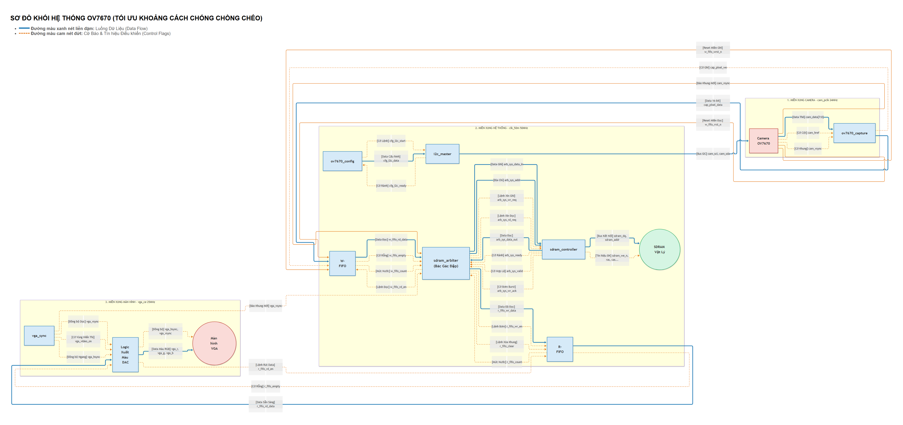

# BÁO CÁO KỸ THUẬT TOÀN DIỆN: DỰ ÁN HỆ THỐNG CAMERA OV7670 TRÊN FPGA

**Hệ thống thu nhận, xử lý và hiển thị Video thời gian thực 640x480 qua SDRAM Ping-Pong Buffer trên KIT Terasic DE1**


> [!NOTE]
> Báo cáo này tổng hợp lại toàn bộ kiến trúc hệ thống, lý thuyết cốt lõi về chuẩn I2C, giao thức DVP, bộ đệm Ping-Pong SDRAM và đặc biệt là **Nhật ký Debug 5 Chặng Sinh Tử** để đưa hệ thống từ chỗ màn hình nhiễu rác đến khi xuất ra hình ảnh thực tế hoàn hảo.

---


# I. TỔNG QUAN KIẾN TRÚC HỆ THỐNG

# 🗺️ SƠ ĐỒ KHỐI HỆ THỐNG TOÀN DIỆN (FULL SYSTEM TOPOLOGY)

Dưới đây là hình ảnh toàn cảnh hệ thống:


## Chú thích luồng hệ thống:
1. **Luồng Cấu Hình (I2C):** Mạch `ov7670_config` nạp mã từ ROM vào `i2c_master` để thiết lập các thanh ghi Camera (phân giải, màu sắc) ngay sau khi boot.
2. **Luồng Video Thu Nhận:** Camera phun dữ liệu 8-bit. Mạch `ov7670_capture` gom 2 byte thành 1 Pixel 16-bit và đẩy vào ngõ ghi của `W-FIFO` (chạy theo xung 24MHz của camera).
3. **Bộ Đệm Trung Tâm (SDRAM Arbiter):** Đóng vai trò tổng chỉ huy (Gác đập). Arbiter bơm nước (Video data) từ W-FIFO lên SDRAM, đồng thời hút nước từ SDRAM rót vào R-FIFO (chạy theo xung 50MHz).
4. **Luồng Xuất Hình VGA:** Khối `vga_sync` sinh ra tọa độ quét (25MHz). Khi tới vùng hiển thị (video_on), khối DAC hút data từ R-FIFO, tách thành kênh R-G-B xuất ra màn hình vật lý.
5. **Cơ Chế Đồng Bộ:** Mọi thứ được thắt nút bằng tín hiệu `vsync`. Vsync reset hàng loạt các con trỏ địa chỉ, đảm bảo khung hình luôn được quét từ điểm đầu tiên ở góc trên cùng bên trái.


## MÔ HÌNH TRỪU TƯỢNG HÓA LUỒNG DỮ LIỆU (DATA FLOW)

Để dễ hình dung hệ thống phần cứng phức tạp này, có thể áp dụng tư duy hình tượng hóa vào 2 nút thắt quan trọng nhất của hệ thống: **Khâu hứng dữ liệu (Capture)** và **Khâu phân luồng bộ nhớ (Arbiter)**.


### 1. Trạm đóng gói kẹo 16-gram (Mô hình DVP Capture)

Hãy tưởng tượng luồng chảy dữ liệu từ Camera đi vào FPGA giống như một **Trạm đóng gói kẹo** nằm trên một băng chuyền chạy với tốc độ PCLK (24MHz).

1. **Băng chuyền chạy:** Camera liên tục ném lên băng chuyền từng viên kẹo 8-gram (D[7:0]).

2. **Luật chơi (HREF):** Trạm đóng gói chỉ được phép gắp kẹo đưa vào phễu khi đèn báo hiệu HREF sáng (báo hiệu dữ liệu hợp lệ).

3. **Nhào nặn (Lắp ráp):** Vì mục tiêu là đóng gói 16-gram (Pixel RGB565), máy phải chờ gắp viên kẹo thứ nhất (Byte cao - cất vào túi tạm), sau đó đợi đến nhịp tiếp theo để gắp viên kẹo thứ hai (Byte thấp).

4. **Xuất xưởng:** Ngay tại nhịp thứ 2, máy ép 2 viên kẹo 8-gram lại với nhau thành 1 gói 16-gram (pixel_data), lập tức bật đèn xanh (pixel_valid = Write Enable) và quăng tọt vào thùng chứa phía sau (chính là W-FIFO). Quá trình này lặp lại liên tục cho đến hết hàng.

5. **Qua ngày mới (VSYNC):** Khi cờ VSYNC phất lên, giám đốc xưởng hô to: "Xong một bức tranh kẹo! Quét sạch phễu chứa, reset bộ đếm, chuẩn bị đón ca mới!".


### 2. Mô hình "Người Gác Đập và Hệ thống Thủy lợi" (Giải phẫu luồng dữ liệu SDRAM Ping-Pong)

Để giải quyết bài toán chênh lệch tốc độ giữa Camera (chảy chậm, ngắt quãng) và Màn hình VGA (hút nước liên tục, tốc độ cực cao), hệ thống SDRAM Arbiter được thiết kế như một **Hệ thống thủy lợi quy mô lớn**, trong đó mỗi module phần cứng đóng một vai trò vật lý rất rõ ràng:

1. **W-FIFO (Bồn chứa trung chuyển đầu nguồn):**
Camera giống như một con suối tự nhiên, dòng chảy (PCLK) không đều đặn và có những lúc ngắt quãng (Blanking). W-FIFO chính là một **Bồn chứa nước nhỏ** đặt ngay dưới thác nước. Khối DVP Capture liên tục hứng từng giọt nước từ Camera đổ vào bồn này. Mục đích của bồn W-FIFO là gom đủ một lượng nước nhất định (ví dụ: 256 giọt) để chuẩn bị cho một lần xả lớn, tránh việc phải vận chuyển từng giọt một cách lắt nhắt gây lãng phí băng thông bộ nhớ.

2. **SDRAM (Hồ chứa thủy điện khổng lồ - Ping-Pong Bank):**
Đây là lõi của hệ thống. SDRAM giống như một **Hồ chứa nước khổng lồ** có khả năng chứa hàng triệu khối nước (đủ không gian cho toàn bộ khung hình 640x480). 
Tuy nhiên, để tránh việc nước sạch mới bơm vào bị lẫn lộn với nước cũ đang xả ra (gây hiện tượng xé hình ngang - Tearing), hồ chứa này được chia làm 2 nửa phân lô độc lập: **Hồ A (Bank 0)** và **Hồ B (Bank 1)**. 
- Khi Hồ A đang mở cổng cho Camera đổ nước mới vào, thì Hồ B sẽ đóng cổng nạp và chỉ mở cổng xả để cấp nước cho VGA.
- Khi cờ VSYNC phất lên (báo hiệu Camera đã vẽ xong 1 khung hình), chức năng của 2 hồ lập tức đảo ngược cho nhau (Ping-Pong). Hai luồng nước Đọc/Ghi sẽ không bao giờ giẫm chân lên nhau!

3. **R-FIFO (Tháp nước áp lực cao khu dân cư):**
Màn hình VGA giống như một khu dân cư đông đúc. Khu dân cư này tiêu thụ nước liên tục với tốc độ cực kì khủng khiếp (25MHz) và tuyệt đối không chấp nhận việc bị ngắt quãng (nếu ngắt quãng, màn hình sẽ bị lệch pixel và nhiễu tĩnh ngay lập tức). 
Do đó, ta không thể nối ống trực tiếp từ Hồ SDRAM (vốn có độ trễ lớn và thỉnh thoảng phải dừng lại để tự sạc điện - Auto Refresh) đến khu dân cư được. R-FIFO chính là một **Tháp nước áp lực cao** đặt ngay sát khu dân cư VGA. Tháp nước này luôn được giữ ở mức đầy, đảm bảo áp lực nước xả xuống VGA luôn mạnh mẽ, trơn tru và liên tục không ngừng nghỉ.

4. **SDRAM Arbiter (Người Gác Đập tẫn mẫn):**
Đây chính là bộ não điều phối (Finite State Machine - FSM) của toàn bộ hệ thống. Arbiter đóng vai trò là một **Người Gác Đập** tay cầm bộ đàm, đứng giữa Hồ khổng lồ (SDRAM) và hai đầu bồn chứa (W-FIFO, R-FIFO). Người Gác Đập gác đập tuân thủ một quy tắc sinh tử:
- Người Gác Đập nhìn về phía Tháp nước R-FIFO. Tháp nước luôn được **ưu tiên tuyệt đối**. Hễ thấy Tháp nước vơi đi một nửa, Người Gác Đập lập tức bật siêu máy bơm, rút đúng 256 khối nước từ Hồ SDRAM bơm tốc hành lên Tháp (Burst Read) để cứu khát cho khu dân cư VGA.
- Khi Tháp nước R-FIFO đã an toàn, Người Gác Đập mới quay sang nhìn Bồn trung chuyển W-FIFO. Nếu thấy bồn W-FIFO đã tích đủ 256 giọt nước từ suối Camera, Người Gác Đập sẽ mở van để hút trọn 256 giọt nước đó đổ vào Hồ SDRAM (Burst Write).
- Nếu thiếu đi Người Gác Đập (hoặc Người Gác Đập bị treo máy do lỗi logic mất tín hiệu phao đo), Tháp nước R-FIFO sẽ cạn kiệt, VGA sẽ "chết khát" và màn hình sẽ ngay lập tức hiện đầy bùn đất (dữ liệu rác)!

---

> *Sau khi đã nắm vững bức tranh tổng quát và mô hình dữ liệu trừu tượng, trọng tâm tiếp theo sẽ đi sâu vào mổ xẻ chi tiết từng khối phần cứng, bắt đầu từ Khối khởi tạo cấu hình I2C.* 

---


# II. THIẾT KẾ KHỐI CẤU HÌNH I2C

# BÁO CÁO KIẾN TRÚC: LÕI GIAO TIẾP I2C (OVERSAMPLING 4X)

Báo cáo này tổng hợp lại những nguyên lý thiết kế cốt lõi của khối `i2c_master` và `i2c_clk_gen`, giải thích tại sao kiến trúc này đạt chuẩn công nghiệp và an toàn tuyệt đối về mặt định thời (Timing).

---

## 1. Bản chất Vật lý của I2C và Giới hạn Tần số

Dù FPGA (Master) chạy ở xung nhịp hệ thống rất cao (50MHz), ta tuyệt đối không thể ném 50MHz ra đường dây SCL của I2C. Có 2 lý do chí mạng:

1. **Giới hạn của Camera (Slave):** Mạch giải mã SCCB/I2C của phần lớn cảm biến (như OV7670) chỉ hỗ trợ tốc độ tối đa là **400 KHz**. 
2. **Đặc tính Mạch Cực máng (Open-Drain):** Giao thức I2C bắt buộc phải dùng điện trở kéo lên (Pull-up Resistor). Khi FPGA thả dây SCL, điện áp mất một khoảng thời gian đáng kể để "bò" từ 0V lên 3.3V (do hằng số thời gian RC). Nếu chạy ở 50MHz, điện áp chưa kịp nhích lên đã bị dập xuống, dẫn đến tín hiệu bị phẳng lỳ ở 0V.

Do đó, FPGA đóng vai trò như một **Hộp số (Gearbox)**, lấy xung 50MHz đếm chậm lại để gõ nhịp 400 KHz ra đường dây SCL.

---

## 2. Bí kíp "Clock Enable" (Tick 4x) - Tại sao không dùng bộ chia Clock?

Để tạo ra 400 KHz, cách ngây thơ nhất là chia 50MHz ra một xung vuông 400 KHz (Ripple Clock) và dùng nó cấp cho FSM. Tuy nhiên, kỹ thuật này gây ra trễ pha và lỗi Timing trầm trọng. 

Kiến trúc chuẩn công nghiệp giải quyết bằng cách **chia hệ thống thành 2 khối đồng bộ hoàn toàn với 50MHz**:

### Khối `i2c_clk_gen` (Nhạc trưởng)
Khối này đếm xung 50MHz và tạo ra một xung chớp nhoáng (Tick) kéo dài đúng 1 chu kỳ 50MHz. Xung chớp này xuất hiện với tần số nhanh gấp **4 LẦN** tần số I2C cần thiết (ví dụ: I2C là 400KHz thì Tick là 1.6MHz).

### Khối `i2c_master` (Nhạc công)
Bên trong `i2c_master` có một bộ đếm `tick_cnt` chạy từ **0 đến 3**. Mỗi lần nghe tiếng Tick, nó tăng thêm 1. Nhờ chia 1 chu kỳ I2C ra làm 4 phách, Master có thể vẽ ra sóng SCL và chốt dữ liệu SDA một cách an toàn tuyệt đối:

*   **Phách 0 (`tick_cnt == 0`):** Kéo `SCL = 0`. Tín hiệu chạm đáy. Đây là lúc an toàn để Master **thay đổi dữ liệu trên dây SDA**.
*   **Phách 1 (`tick_cnt == 1`):** Kéo `SCL = 1`. Tín hiệu vọt lên đỉnh (Cạnh lên).
*   **Phách 2 (`tick_cnt == 2`):** Giữ `SCL = 1`. Đỉnh điểm của sóng. Dữ liệu SDA lúc này ổn định nhất, không có nhiễu. Đây là **thời điểm vàng để đọc SDA** (VD: đọc bit ACK từ Slave).
*   **Phách 3 (`tick_cnt == 3`):** Kéo `SCL = 0`. Tín hiệu rơi xuống đáy (Cạnh xuống), kết thúc 1 chu kỳ bit.

Nhìn từ bên ngoài, SCL lên xuống như một xung Clock 400KHz. Nhưng nhìn từ bên trong FPGA, SCL chỉ là một chân tín hiệu (Data) đang bật tắt dưới sự kiểm soát của FSM 50MHz.

---

## 3. Phân biệt "Đồng bộ (Synchronous)" và "Bất đồng bộ (Async CDC)"

Khối Hộp số I2C này **KHÔNG** hề sử dụng FIFO Bất đồng bộ (Dual-Clock Async FIFO), và cũng **KHÔNG** xử lý nhiễu đa xung nhịp (Clock Domain Crossing - CDC). 

*   Toàn bộ quá trình tạo sóng SCL đều nằm hoàn toàn trong **"Vương quốc 50MHz"** của FPGA. Thiết kế này là Đồng bộ hoàn toàn (Fully Synchronous).
*   **Khi nào mới cần Async FIFO?** Async FIFO chỉ xuất hiện khi có 2 vương quốc độc lập. Cụ thể trong dự án OV7670 này, Async FIFO sẽ được dùng ở khối **Hứng ảnh (DVP Capture)**, nơi mà xung nhịp `PCLK` (do Camera tự sinh ra) đụng độ với xung nhịp `50MHz` của FPGA. Lúc đó, FIFO đóng vai trò làm bãi đệm triệt tiêu sự lệch pha giữa 2 hệ thống độc lập này.


# Nghệ thuật Thiết kế I2C Deep Dive

Giao thức I2C là một tiêu chuẩn phổ biến, nhưng để triển khai nó trên nền tảng logic số (như FPGA) một cách trơn tru, mạnh mẽ thì lại là một "nghệ thuật" thực sự. Tài liệu này chắt lọc những tư duy cốt lõi về thiết kế I2C Master, đặc biệt là khi giao tiếp với các thiết bị như Camera OV7670.

## 1. Cơ chế 4 Ticks của I2C: Tại sao phải chia làm 4 phách?
Khi viết máy trạng thái (FSM) cho I2C, một kỹ thuật cực kỳ hiệu quả là chia một chu kỳ xung nhịp SCL (I2C Clock) thành **4 phách (4 ticks)**. Thay vì cố gắng thay đổi dữ liệu (SDA) và xung nhịp (SCL) cùng một lúc, hệ thống rải chúng ra:

- **Tick 1 (SDA Change):** Đổi trạng thái dây SDA khi dây SCL đang ở mức thấp. Việc thay đổi SDA lúc SCL thấp đảm bảo tính hợp lệ của dữ liệu (tránh vô tình tạo ra điều kiện Start/Stop).
- **Tick 2 (SCL Rise):** Kéo dây SCL lên mức cao.
- **Tick 3 (SDA Sample/Read):** Đọc giá trị trên dây SDA. Khoảng thời gian từ Tick 2 tới Tick 3 là thời gian SCL duy trì ở mức cao và SDA đã cực kỳ ổn định, là thời điểm hoàn hảo nhất để chốt (latch) dữ liệu từ Slave.
- **Tick 4 (SCL Fall):** Kéo dây SCL xuống mức thấp trở lại, chuẩn bị cho chu kỳ tiếp theo.

Việc chia thành 4 phách tạo ra những khoảng Margin an toàn, tránh vi phạm thời gian Setup (Setup time) và Hold (Hold time), giúp đường truyền cực kỳ bền bỉ kể cả khi nhiễu.

## 2. Nghệ thuật Clock Enable: Ảo giác tốc độ
Nhiều kỹ sư nhầm tưởng rằng để tạo ra I2C 400kHz, họ phải dùng mạch chia xung (Clock Divider/PLL) tạo ra một xung nhịp clock 400kHz độc lập để cung cấp cho module I2C. Điều này dẫn đến sự cố tồi tệ về Clock Domain Crossing (CDC).

**Sự thật về ảo giác tốc độ:** Toàn bộ hệ thống logic I2C Master thực chất vẫn chạy hoàn toàn trên xung nhịp gốc (ví dụ: `50MHz` của hệ thống). Để đáp ứng tốc độ `400kHz` của cảm biến, hệ thống sử dụng một bộ đếm (Counter) liên tục đếm trên nền xung 50MHz. Cứ mỗi `(50MHz / (400kHz * 4))` chu kỳ, bộ đếm sẽ bật một cờ `tick_4x` (chỉ kéo dài trong 1 chu kỳ 50MHz).
Biến `tick_4x` này hoạt động như một cờ Clock Enable. Khối I2C Master luôn lấy clock 50MHz, nhưng chỉ chuyển trạng thái (chuyển sang Tick kế tiếp của I2C) khi `tick_4x` được bật. Việc này đảm bảo logic hoạt động hoàn toàn đồng bộ, an toàn, và chính xác mà không sinh ra một xung clock mới.

## 3. Giao tiếp Handshake (Bắt tay): Mối tình giữa Config và Master
Trong thiết kế cấu hình Camera, hệ thống có khối `OV7670_Config` (chứa các thông số thanh ghi ROM) và khối `i2c_master` (thực thi việc truyền I2C). Khối Config chạy cực kỳ nhanh (mỗi xung 50MHz là 1 bước), trong khi I2C Master mất hàng ngàn xung 50MHz mới truyền xong một byte. Làm sao để chúng làm việc với nhau mà không ách tắc?

Giải pháp nằm ở tín hiệu Handshake (Bắt tay) gồm 2 cờ: `start` và `ready`.
- Khối `i2c_master` bình thường luôn giữ cờ `ready = 1` để thông báo "nhóm phát triển rảnh".
- Khối `OV7670_Config` khi cần truyền một lệnh cấu hình, nó đặt dữ liệu lên bus và bật cờ `start = 1` trong đúng 1 chu kỳ clock.
- Ngay khi thấy `start`, `i2c_master` lập tức kéo `ready = 0` (Báo bận) và bắt đầu quá trình truyền tốn thời gian của mình.
- Trong lúc đó, khối `OV7670_Config` nằm chờ (Wait State) cho đến khi `ready` quay trở lại mức `1`.
- Khi truyền xong, `i2c_master` trả `ready = 1`. `OV7670_Config` thấy vậy liền lấy dữ liệu kế tiếp ra và chu kỳ lại tiếp tục.

Nhờ cơ chế Handshake tinh tế này, dữ liệu không bao giờ bị dồn ứ hay mất mát, đảm bảo mọi thanh ghi đều được lập trình tuần tự và trọn vẹn, không hề "lỗi nhịp".


---

> *Sau bước khởi tạo I2C, cảm biến bắt đầu xuất luồng dữ liệu quang học liên tục. Nhiệm vụ cốt lõi tiếp theo của hệ thống FPGA là thu nhận luồng dữ liệu này một cách toàn vẹn thông qua giao thức DVP Capture và điều phối qua bộ đệm SDRAM.* 

---


# III. LÝ THUYẾT DVP CAPTURE VÀ PING-PONG SDRAM

## 1. Bản chất của khối DVP Capture

Khối DVP (Digital Video Port) Capture đóng vai trò là giao diện trực tiếp đầu tiên giữa FPGA và cảm biến quang học. Đây là cánh cổng thu nhận luồng dữ liệu liên tục từ thế giới thực. Bất kỳ sự sai lệch nào về xung nhịp (Clock) tại khối này đều sẽ dẫn đến việc sai lệch toàn bộ cấu trúc điểm ảnh của khung hình.

## 1. Kiến trúc tổng thể và Giải phẫu tín hiệu DVP chi tiết

**A. Nhận diện Đầu vào (Input) – "Nguyên liệu thô từ mỏ":**
Khối DVP Capture không tự sinh ra dữ liệu, nó đóng vai trò là "trạm kiểm lâm" đứng ở cửa rừng.
- **Nguồn gốc:** Tín hiệu đến *trực tiếp từ phần cứng của Camera Sensor* đi qua các chân GPIO vật lý trên board mạch FPGA.
- **Thành phần cốt lõi:**
  - `PCLK` (Pixel Clock): Nhịp tim của camera (~24MHz). Cứ mỗi xung nhịp, camera sẽ nhả ra một khối dữ liệu nhỏ.
  - `VSYNC` (Vertical Sync): Cờ lệnh của tổng tư lệnh báo hiệu bắt đầu một khung hình (Frame) mới. (High = Blanking, Low = Active Frame).
  - `HREF` (Horizontal Reference): Cờ báo hiệu của đội trưởng dòng (Line) cho biết dữ liệu đang truyền là hợp lệ.
  - `D[7:0]`: Bus dữ liệu 8-bit, chở từng mảnh màu sắc thô.

> [!NOTE]
> **Góc Nhìn Lịch Sử & Bản Chất Vật Lý: Tại sao lại có Vùng Đen (Blanking)?**
> 
> Tín hiệu điều khiển DVP thực chất mang theo "DNA" di truyền từ thời đại **Tivi CRT (Ống phóng tia âm cực)**. Trong hệ thống CRT cổ điển, súng bắn electron sau khi quét xong một dòng (từ trái sang phải) cần một khoảng thời gian tắt tia sáng để "lùi nòng" về lề trái chuẩn bị quét dòng tiếp theo (H-Blanking), cũng như lùi từ đáy màn hình chạy ngược lên đỉnh màn hình (V-Blanking).
> 
> Camera OV7670 tuy là chip cảm biến CMOS kỹ thuật số hiện đại, nhưng vẫn được thiết kế để **giả lập y chang** chuẩn Analog truyền thống này nhằm đảm bảo tính tương thích vạn năng.
> 
> **Nguy cơ phần cứng tiềm ẩn:** Trong khoảng thời gian "súng đang lùi" này (khi `HREF = 0`), các đường dây dữ liệu `D[7:0]` bị thả nổi và xả ra toàn "rác" điện tử (Garbage Data). Do đó, việc thiết kế bẫy **`if (href == 1'b1)` chính là màng lọc sinh tử** — nếu bỏ qua cờ này, bộ đệm Async FIFO của hệ thống sẽ nuốt trọn rác, làm xô lệch tọa độ của toàn bộ các điểm ảnh ở các hàng bên dưới!

**B. Nhận diện Đầu ra (Output) – "Sản phẩm tinh chế xuất xưởng":**
Khối này đứng trước Async FIFO và làm nhiệm vụ nhồi dữ liệu vào FIFO.
- **Đích đến:** Đẩy thẳng vào cửa ngõ của **Async FIFO** (Khối đệm chuyển vùng Clock).
- **Thành phần:**
  - `pixel_data` (16-bit): Dữ liệu điểm ảnh RGB565 đã được lắp ráp hoàn chỉnh.
  - `pixel_valid` (1-bit): Tín hiệu Write Enable (WEN) ra lệnh cho Async FIFO: "Có điểm ảnh chuẩn rồi, mở cửa cất vào kho ngay!".

**C. Mô hình hóa Luồng dữ liệu (Data Flow) – "Trạm đóng gói kẹo trên băng chuyền":**
Hãy tưởng tượng luồng chảy dữ liệu của khối DVP Capture giống như một **Trạm đóng gói kẹo 16-gram** nằm trên một băng chuyền chạy với tốc độ `PCLK`.
1. **Băng chuyền chạy:** Camera liên tục ném lên băng chuyền từng viên kẹo 8-gram (`D[7:0]`).
2. **Luật chơi (HREF):** Trạm đóng gói chỉ được phép gắp kẹo đưa vào phễu khi đèn báo hiệu `HREF` sáng (dữ liệu hợp lệ).
3. **Nhào nặn (Lắp ráp):** Vì mục tiêu là đóng gói 16-gram (Pixel RGB565), máy phải chờ gắp viên kẹo thứ nhất (Byte cao - cất vào túi tạm), sau đó đợi đến nhịp tiếp theo để gắp viên kẹo thứ hai (Byte thấp). 
4. **Xuất xưởng:** Ngay tại nhịp thứ 2, máy ép 2 viên kẹo 8-gram lại với nhau thành 1 gói 16-gram (`pixel_data`), lập tức bật đèn xanh (`pixel_valid`) và quăng tọt vào thùng chứa phía sau (chính là Async FIFO). Quá trình này lặp lại liên tục cho đến hết hàng.
5. **Qua ngày mới (VSYNC):** Khi cờ `VSYNC` phất lên, giám đốc xưởng hô to: "Xong một bức tranh kẹo! Quét sạch phễu chứa, reset bộ đếm, chuẩn bị đón ca mới!".

## 2. Nghệ thuật ghép ảnh RGB565: Bức Tranh 16-bit Từ Mảnh Ghép 8-bit
Camera truyền dữ liệu theo chuẩn màu RGB565, tức là một điểm ảnh (Pixel) cần 16-bit (5 bit Đỏ, 6 bit Xanh lá, 5 bit Xanh dương). Nhưng dây chuyền D[7:0] chỉ rộng 8-bit!
**Cách giải quyết của luồng dữ liệu (Data flow):** 1 Pixel (16-bit) = 2 nhịp PCLK.
- **Nhịp PCLK thứ 1 (Bắt Byte Cao):** Khi `HREF = 1`, ta bắt lấy 8-bit đầu tiên (R[4:0] và G[5:3]). Logic cần phải lưu nó vào một thanh ghi tạm (latch/buffer).
- **Nhịp PCLK thứ 2 (Bắt Byte Thấp):** Bắt lấy 8-bit tiếp theo (G[2:0] và B[4:0]).
- **Đóng gói (Packing):** Khối DVP sẽ ghép "Byte Cao" đang chờ sẵn và "Byte Thấp" vừa tới thành một từ 16-bit hoàn chỉnh và bật cờ tín hiệu `pixel_valid` để đẩy đi tiếp.

## 3. Cầu nối Async FIFO: Vượt Qua Khoảng Cách Không Gian - Thời Gian (Clock Domain)
Khối DVP Capture hoạt động **HOÀN TOÀN** dựa trên xung **PCLK của Camera**, KHÔNG DÙNG xung nội hệ thống của FPGA. 
Nó đem dữ liệu 16-bit đóng gói đẩy vào một **Async FIFO** (Bộ đệm FIFO bất đồng bộ). Đầu kia của FIFO (Read Domain) sẽ được điều khiển bởi khối xử lý hệ thống bằng xung nhịp 50/100MHz. Thiết kế này giúp hai miền xung nhịp (Clock Domains) độc lập, không dẫm đạp lên nhau!

---

> [!CAUTION]
> ## ⚠️ LUẬT THÉP: CẠM BẪY DỄ SAI VÀ LƯU Ý SỐNG CÒN
> 1. **CẠM BẪY CLOCK DOMAIN CROSSING (CDC):** Tuyệt đối không lấy tín hiệu `pixel_data` ném thẳng vào RAM hoặc bộ xử lý ảnh mà bỏ qua Async FIFO. Hậu quả: Vi phạm Setup/Hold time sinh ra Metastability, màn hình sẽ nhiễu sọc (Tearing) hoặc hệ thống sập hoàn toàn!
> 2. **LỖI LỆCH BYTE (BYTE MISALIGNMENT):** Lúc khởi động, tín hiệu chưa ổn định, hệ thống rất dễ bắt nhầm "Byte Thấp" làm "Byte Cao". Hệ quả: Màu sắc loạn xạ, nhiễu hột cát. *Luật thép:* Phải luôn dựa vào sườn xuống của VSYNC (bắt đầu khung hình mới) để Reset lại cờ chọn Byte, đảm bảo Byte đầu tiên sau VSYNC chắc chắn là Byte Cao.
> 3. **BÓNG MA RÁC ĐẦU KHUNG HÌNH:** Khi VSYNC vừa chuyển trạng thái, đường truyền từ sensor mất một vài xung nhịp `PCLK` để thực sự ổn định. Nếu logic bắt ngay pixel đầu tiên không có độ trễ an toàn, hệ thống sẽ bắt nhầm "nhiễu" thành điểm ảnh đầu tiên.
> 4. **CẠM BẪY PHÂN CỰC (POLARITY TRAP):** Các loại sensor khác nhau quy định phân cực VSYNC/HREF khác nhau. Phải soi Datasheet kỹ xem Active-High hay Active-Low, nếu code mù quáng thì "trạm đóng gói kẹo" của hệ thống sẽ đứng gói rác!

## 4. Sự Khác Biệt Cốt Lõi: Đọc Ảnh Tĩnh (Static) vs. Xử Lý Camera Thời Gian Thực (Real-time)

**Sự ngỡ ngàng thường gặp:** Tại sao khối Camera (Capture) chỉ nhận dữ liệu vào mà lại phải xuất ra địa chỉ `addr`? Để hiểu rõ, hệ thống cần nhìn vào sự khác biệt căn bản giữa hai hệ thống:

**1. Đọc ảnh tĩnh từ ROM/Thẻ nhớ (Static)**
- Dữ liệu hình ảnh đã có sẵn và nằm im trong bộ nhớ.
- Hệ thống chỉ có **1 "công nhân" duy nhất** là khối VGA Controller. 
- Khối VGA tự động sinh ra tọa độ quét (Read Address) để móc dữ liệu từ bộ nhớ ra và hiển thị lên màn hình một cách tuần tự. Không ai tranh giành quyền truy cập bộ nhớ với nó.

**2. Xử lý Camera thời gian thực (Real-time)**
- Đây là một "trận chiến" của **2 người công nhân độc lập** cùng hoạt động trên một cái kho SDRAM duy nhất (Shared Memory).
  - **Khối Camera (Đầu Bơm):** Không chỉ nhận luồng tín hiệu từ OV7670, khối DVP Capture phải làm nhiệm vụ "Tiền xử lý": đóng gói các byte dữ liệu thành 1 pixel 16-bit RGB565 và quan trọng nhất là **TỰ ĐỘNG sinh ra tọa độ cất kho (Write Address)** để điền kín dữ liệu vào Frame Buffer một cách chính xác theo thời gian thực.
  - **Khối VGA (Đầu Hút):** Chạy hoàn toàn độc lập với tốc độ riêng của màn hình. Nhiệm vụ của nó là liên tục sinh ra tọa độ lấy kho (Read Address) để hút dữ liệu ra và vẽ lên màn hình.

**Nhấn mạnh:** Việc giao phó cho khối DVP Capture đảm nhận vai trò "Tiền xử lý" (đóng gói 16-bit và cấp Write Address) là một thiết kế tối ưu. Nó giúp **giảm tải hoàn toàn** gánh nặng tính toán địa chỉ cất giữ cho SDRAM Controller và khối VGA, cho phép hệ thống vận hành trơn tru trong điều kiện thời gian thực khắt khe.

## 5. Nâng cấp Kiến trúc: Tại sao phải chuyển từ Line Buffer lên Ping-Pong Frame Buffer?

Trong các thiết kế xử lý ảnh tĩnh cơ bản, người ta thường dùng **Line Buffer** (chỉ đệm 1-2 hàng điểm ảnh) hoặc **Single Buffer** (chỉ dùng 1 kho duy nhất). Nhưng đối với hệ thống Camera thời gian thực, đây là một thiết kế tiềm ẩn rủi ro rất lớn mang tên **Xé hình (Screen Tearing)**.

**1. Thảm họa chênh lệch tốc độ (Tearing Disaster)**
- Tốc độ "bơm" của Camera (Write): Chạy bằng xung `PCLK` ~24MHz, nhưng cần 2 nhịp mới ra được 1 pixel. Tốc độ bơm thực tế chỉ khoảng **12 Triệu pixel/giây (30fps)**.
- Tốc độ "hút" của VGA (Read): Màn hình 640x480@60Hz yêu cầu chốt pixel liên tục ở mức **25 Triệu pixel/giây (60fps)**.
- **Hệ quả:** Đầu hút VGA chạy nhanh gấp đôi đầu bơm Camera! Nếu bắt chúng dùng chung 1 cái Line Buffer hoặc 1 Frame Buffer duy nhất, VGA sẽ nhanh chóng "chạy vượt mặt" Camera. Khi đó trên màn hình, nửa trên sẽ là ảnh của khung hình mới, nửa dưới lại là ảnh của khung hình cũ chắp vá lại, gây giật lag và xé hình trầm trọng.

**2. Giải pháp tối thượng: Ping-Pong Frame Buffer (Đệm kép luân phiên)**
Để giải quyết triệt để, hệ thống quy hoạch chip SDRAM thành 2 "mảnh đất" khổng lồ: **Bank 0** và **Bank 1** (sử dụng bit cao nhất của địa chỉ làm cờ chọn Bank).
- **Cơ chế cách ly:** Khối Camera cứ việc hì hục đổ đất (Write) vào **Bank 0**, trong khi khối VGA cứ ung dung lấy đất (Read) từ **Bank 1** ra vẽ. Hai người công nhân làm việc ở 2 kho hoàn toàn cách biệt, không bao giờ dẫm chân lên nhau.
- **Cơ chế đổi ca (Swap Bank):** Ngay khi sườn xuống của tín hiệu `camera_vsync` xuất hiện (báo hiệu Camera đã chụp xong trọn vẹn 1 bức ảnh vào Bank 0), khối SDRAM Arbiter sẽ lập tức hoán đổi vị trí:
  - Khung hình tiếp theo, Camera chuyển sang cày cuốc ở **Bank 1**.
  - VGA được cấp quyền sang **Bank 0** để hút bức ảnh mới nhất vừa ra lò.

Thiết kế Ping-Pong Buffer này là tiêu chuẩn vàng (Golden Standard) trong công nghiệp truyền phát Video, giúp luồng ảnh chảy mượt mà 100% bất chấp sự sai lệch tốc độ giữa thiết bị thu và thiết bị phát!


---

> *Quá trình triển khai lý thuyết thiết kế lên phần cứng vật lý luôn đi kèm với các thách thức về định thời (Timing) và đồng bộ. Dưới đây là Nhật ký khắc phục sự cố (Debug Log) ghi lại toàn bộ quá trình tối ưu hóa hệ thống, minh chứng cho phương pháp cô lập lỗi và phân tích tín hiệu (Waveform Analysis).* 

---


# IV. NHẬT KÝ SỬA LỖI (BUG HUNTING & DEBUGGING)

# NHẬT KÝ SỬA LỖI CHẶNG 1 - HIỆN TƯỢNG MÀN HÌNH RÁC VÀ "CÁI BỒN NƯỚC KHÔNG PHAO"

## 1. Hình ảnh hiện tượng

*(Miêu tả: Màn hình hiển thị nhiễu hạt sọc ngang, có đường cắt dọc ở giữa X=320, hình ảnh tĩnh không thay đổi dù che hay mở camera).*

## 2. Nguyên nhân gốc rễ (Lỗi Logic Trọng tài & Khởi động Camera)
Dự án gặp phải 2 vấn đề nghiêm trọng chạy song song:

- **Lỗi 1 (Camera chết lâm sàng):** 
  Cấp nguồn xong, vi mạch FPGA chạy quá nhanh, bắn lệnh cấu hình SCCB (I2C) ngay lập tức. Kết quả là Camera không kịp khởi động, chưa sẵn sàng nhận lệnh nên đã "bỏ qua" toàn bộ cấu hình.
  
- **Lỗi 2 (Treo máy trạng thái Arbiter do mất phao đo):** 
  Sử dụng nhầm module `async_fifo` cho R-FIFO (Read FIFO từ SDRAM ra VGA). Vì module `async_fifo` này không có cổng `count` xuất ra, dây tín hiệu `r_fifo_count` bị bỏ lửng (Floating = 0).

## 3. Mô hình Trừu tượng (Mạng Lưới Bơm Nước)
Hãy tưởng tượng hệ thống FPGA của hệ thống là một mạng lưới cấp nước:

- **SDRAM:** Là một cái Hồ Chứa Nước khổng lồ ở giữa.
- **Camera:** Là dòng suối liên tục chảy nước thô vào. Nước này được hứng tạm vào cái Xô Đầu Vào (W-FIFO).
- **Màn hình VGA:** Là một khu dân cư tiêu thụ nước liên tục không ngừng nghỉ. Nước cấp cho dân được chứa trong một cái Tháp Nước Đầu Ra (R-FIFO).
- **SDRAM Arbiter:** Là Người Gác Đập (Trọng tài). Người Gác Đập này đứng ở giữa, tay cầm van xả và phải làm cùng lúc 2 nhiệm vụ:
  - Nhiệm vụ 1: Bơm nước từ Hồ Chứa (SDRAM) lên Tháp Nước (R-FIFO) để dân (VGA) có nước xài.
  - Nhiệm vụ 2: Hút nước từ Xô Đầu Vào (W-FIFO) đổ vào Hồ Chứa (SDRAM) để cất trữ ảnh từ Camera.

**Luật làm việc của Người Gác Đập rất rõ ràng:** Ưu tiên số 1 là dân không được chết khát (VGA mất dữ liệu là xé hình ngay). Người Gác Đập phải nhìn vào cái phao đo mực nước (`count`) trên Tháp Nước R-FIFO.
- Nếu nước trong Tháp cạn (dưới 768 lít): Người Gác Đập cuống cuồng bơm nước từ Hồ lên Tháp.
- Nếu nước trong Tháp đã đầy (trên 768 lít): Dân đã đủ nước xài tạm, Người Gác Đập mới thảnh thơi quay sang hút nước từ Camera đổ vào Hồ.

💥 **Bi kịch của lỗi sọc rác vừa rồi:**
Lúc trước, Agent 2 đã xây cho khu dân cư một cái Tháp Nước loại `async_fifo`. Đặc điểm của cái tháp này là kín bưng, KHÔNG HỀ CÓ phao đo mực nước (`count` bị bỏ trống). Vì không có dây tín hiệu báo về, Người Gác Đập luôn nhìn thấy thông số "Mực nước = 0". Người Gác Đập hoảng loạn tột độ, tưởng dân đang chết khát, nên dành 100% thời gian để bơm nước từ Hồ (SDRAM) lên Tháp (VGA). Người Gác Đập không bao giờ dám quay lưng lại để múc nước từ suối Camera! 
Hậu quả: Camera chảy bao nhiêu nước đều bị vứt bỏ, Hồ chứa SDRAM thì không có giọt nước mới nào, chỉ chứa toàn bùn đất cặn bã từ lúc mới xây (dữ liệu rác lúc cấp nguồn). Khu dân cư VGA thì bị ép uống cái bùn đất đó -> Sinh ra màn hình nhiễu sọc!

## 4. Tại sao lại đem fifo_sync trở lại?
- **Khôi phục Phao Đo Mực Nước (`count`):** Module `fifo_sync` là một cái tháp nước "thông minh" có tích hợp sẵn chân `count` báo mực nước chính xác theo từng chu kỳ. Khi lắp nó vào, Người Gác Đập (Arbiter) thấy được mức nước thực tế, biết lúc nào tháp đã đầy để yên tâm quay sang xử lý data cho Camera.
- **Về mặt thiết kế Clock:**
  - Cái Xô Đầu Vào (W-FIFO) BẮT BUỘC phải dùng `async_fifo` vì nước từ suối Camera chảy vào theo nhịp riêng (`cam_pclk`), còn Người Gác Đập làm việc theo nhịp của Hồ (`clk_50m`).
  - Nhưng cái Tháp Nước Đầu Ra (R-FIFO) thì khác! Người Gác Đập bơm nước vào Tháp bằng nhịp `clk_50m`, và khu dân cư VGA cũng rút nước ra bằng chính nhịp `clk_50m` (có chốt cửa `vga_ce`). Vì Đầu Vào và Đầu Ra chạy cùng một nhịp (Đồng bộ - Sync), hệ thống không cần dùng `async_fifo` phức tạp, mà dùng `fifo_sync` là chuẩn bài toán nhất, vừa nhẹ logic, vừa có sẵn biến `count`.


# BÁO CÁO KỸ THUẬT CHẶNG 2: NGHẼN BĂNG THÔNG GHI SDRAM & BẢN ĐỒ SỬA CHỮA HỆ THỐNG

## 1. Hình ảnh thực tế chặng 2

- **Hiện trạng quan sát:** 
  - Khoảng **1/3 màn hình phía trên** (~160 - 180 dòng quét) đã hiển thị tín hiệu thực tế từ ống kính Camera (có phân vùng sáng tối thực của trần nhà/phòng làm việc).
  - Tuy nhiên, hình ảnh bị **nhiễu sọc ngang rất nặng, xé hình và ám sắc tím**.
  - **2/3 màn hình phía dưới** vẫn trơ trơ dải nhiễu tĩnh mặc định của chip SDRAM.

---

## 2. Minh chứng đối chiếu: Tại sao Project Đọc Ảnh (UART) chạy được mà Project Camera lại gãy?

Để minh định rõ ràng vì sao hệ thống SDRAM hiện tại bị coi là đang chạy ở chế độ **Single Write**, hệ thống hãy trích xuất trực tiếp code gốc từ `D:\FPGA\Projects\project_2_SDRAM_VGA\SDRAM_VGA_final`:

### Bằng chứng code gốc trong `sdram_controller.v`:
Tại dòng 134-135 của file gốc Project 2:
```verilog
// Mode: CAS=3, Read=Full Page, Write=Single Access (Bit 9 = 1)
sdram_addr <= 12'h237; 
```
Và tại dòng 203-204:
```verilog
WRITE_DATA: begin
    // Write là Single Access
```
> **Ý nghĩa phần cứng:** Chuẩn JEDEC của chip SDRAM quy định: Khi nạp Mode Register với **Bit 9 = 1** (giá trị `12'h237`), SDRAM được thiết lập ở chế độ **"Burst Read & Single Write"**. Nghĩa là: **Chỉ có chiều ĐỌC (ra VGA) là chạy Burst 256, còn chiều GHI vẫn là ghi từng từ đơn lẻ (Single Access)!**

### Bảng so sánh tương quan tốc độ giữa 2 Project:

| Tiêu chí so sánh | Project 2: Đọc ảnh qua UART | Project 3: Camera OV7670 | Nhận xét chênh lệch |
| :--- | :--- | :--- | :--- |
| **Nguồn phát dữ liệu** | Cổng UART máy tính (115.200 baud) | Cảm biến ảnh OV7670 (PCLK ~24MHz) | Bản chất nguồn phát |
| **Tốc độ sinh điểm ảnh** | $\approx 5.760$ pixel / giây | $\approx 12.500.000$ pixel / giây | **Camera bắn nhanh gấp 2.170 lần UART!** |
| **Thời gian giữa 2 pixel** | $\approx 173.600\,\text{ns}$ ($173,6\,\mu\text{s}$) | $\approx 80\,\text{ns}$ | Khoảng cách dòng dữ liệu |
| **Cơ chế ghi SDRAM** | Single Write ($200\,\text{ns}$ / pixel) | Single Write ($200\,\text{ns}$ / pixel) | Tái sử dụng nguyên vẹn từ Project 2 |
| **Tương quan Băng thông** | SDRAM ghi **nhanh gấp 868 lần** UART | SDRAM ghi **chậm hơn 2,5 lần** Camera! | **Điểm nghẽn chí tử xuất hiện!** |
| **Trạng thái Bồn W-FIFO** | Luôn rỗng (vừa có pixel là ghi ngay) | **Tràn bồn liên tục (`wfull = 1`)** | Vỡ trận bồn đệm |
| **Kết quả hiển thị** | Ảnh tĩnh mượt mà, đủ khung hình | Chỉ ghi kịp 1/3 khung hình + xé sọc | 2/3 dưới là rác tĩnh |

---

## 3. Phân tích 2 câu hỏi kỹ thuật của Sếp

### Câu hỏi 1: Tại sao chỉ bơm được ~1/3 màn hình?
- **Thời gian 1 khung hình Camera (30 fps):** $33,3\,\text{ms}$.
- **Thời gian VGA đọc chiếm bus SDRAM:** Khoảng $6,4\,\text{ms}$ (ưu tiên cao hơn để không mất đồng bộ hiển thị).
- **Thời gian còn lại để ghi:** $33,3\,\text{ms} - 6,4\,\text{ms} = 26,9\,\text{ms}$.
- **Tốc độ ghi Single Access:** Mỗi pixel tốn 10 chu kỳ xung 50MHz ($200\,\text{ns}$).
- **Số pixel tối đa ghi kịp:** $\frac{26,9\,\text{ms}}{200\,\text{ns}} \approx 134.500\,\text{pixel}$.
- **Tỷ lệ khung hình:** $\frac{134.500}{307.200} \approx \mathbf{43,7\%}$ (Gần đúng 1/3 đến 2/5 chiều cao màn hình, khoảng 180 dòng đầu).
- **Lý do bị cắt ngang:** Hết $33,3\,\text{ms}$, Camera phát xung `vsync_falling` kết thúc khung. Lệnh `write_addr <= 0` trong Arbiter lập tức giật con trỏ về đỉnh màn hình để vẽ khung mới. Con trỏ ghi **chưa bao giờ kịp chạm tới 2/3 diện tích phía dưới**.

### Câu hỏi 2: Tại sao hình ảnh lại bị nhiễu sọc ngang rất nặng?
1. **Tràn bồn W-FIFO gây vứt bỏ pixel:** Nước vào bồn nhanh gấp 2,5 lần nước múc ra. Sau 2-3 dòng quét, W-FIFO bị đầy tràn. Mạch logic bắt buộc phải thả trôi (drop) các pixel tiếp theo.
2. **Sụp đổ đồng bộ trục ngang (H-Sync Desynchronization):** Khi bị rớt điểm ảnh, vị trí tọa độ của dòng này bị thụt lùi và tràn sang dòng khác, khiến các đường quét bị xé toạc theo phương ngang, tạo thành các vệt sóng gợn và sọc chuyển động liên tục.
3. **Nhiễu hạt cảm biến:** Thiếu sáng trong phòng kích hoạt AGC của OV7670 đẩy Gain lên cực đại, cộng thêm việc rớt byte làm sai lệch hệ màu RGB565 sinh ra sắc tím.

---

## 4. BẢN ĐỒ SỬA CHỮA HỆ THỐNG (SYSTEM REPAIR BLUEPRINT)

Để biến chiều GHI thành **Burst Write (256 Words)** tương đương với chiều ĐỌC, hệ thống sẽ được nâng cấp theo sơ đồ sau:

```
[Camera OV7670] 
       │ (1 pixel / 80ns)
       ▼
[ W-FIFO (async_fifo) ] ── (Thêm cổng rcount báo mực nước ở miền 50MHz)
       │
       │ (Khi rcount >= 256 words: Phát lệnh BURST WRITE)
       ▼
[ SDRAM Arbiter ] ─────── (Bắn 1 gói 256 words liên tục)
       │
       ▼
[ SDRAM Controller ] ──── (Chuyển Mode Register sang 12'h037 - Burst Write)
       │
       ▼ (Tốc độ ghi tăng vọt lên 50 MWords/s: 1 pixel / 20ns!)
[ Chip nhớ SDRAM ] ────── Ghi xong cả khung 640x480 chỉ mất 6,5ms!
```

### Chi tiết các bước thực hiện:

1. **Module `rptr_empty.v` & `async_fifo.v`:**
   - Xây dựng mạch giải mã Gray-to-Binary để chuyển `rq2_wptr` thành nhị phân.
   - Tính toán `rcount = wptr_bin - rbin_reg` (mực nước khả dụng của W-FIFO ở miền 50MHz).
   - Xuất cổng `output wire [10:0] rcount`.

2. **Module `sdram_controller.v`:**
   - Cấu hình lại Mode Register: Đổi `12'h237` (Single Write) $\rightarrow$ `12'h037` (Full Page / Programmed Burst Write).
   - Thiết kế trạng thái `WRITE_STREAM`: Bơm liên tục 256 pixel trong 256 nhịp xung nhịp (chỉ mất $5,12\,\mu\text{s}$ cho một khối 256 pixel thay vì $51,2\,\mu\text{s}$ như trước).

3. **Module `sdram_arbiter.v`:**
   - Thay đổi điều kiện ghi: Không ghi nhắt gừng từng pixel khi `!w_fifo_empty` nữa, mà chờ `w_fifo_count >= 256` mới kích hoạt 1 Burst Ghi.
   - Tăng địa chỉ theo khối: `write_addr <= write_addr + 256`.

4. **Module `ov7670_top.v`:**
   - Nối chân `rcount` từ `u_w_fifo` sang `w_fifo_count` của `u_sdram_arbiter`.


## CHẶNG 3: SỰ CỐ "BÁC GÁC ĐẬP NHÂN BẢN NƯỚC" VÀ "DÒNG SUỐI HOA MẮT"

## 1. Hiện tượng tại Khu dân cư (Màn hình VGA)
* Khu dân cư đã nhận đủ nước (đầy đủ khung hình 640x480), nhưng nước lại bị đứt đoạn thành các cột dọc đặc cứng rộng 128px (nhiễu sọc dọc).
* Đặc biệt, sau khoảng 30 giây, các cột nước màu xanh lá này lại từ từ biến chất thành màu tím.

## 2. Bắt bệnh Hệ thống (Nguyên nhân lỗi)
* **Tại sao lại có các cột nhiễu dọc 128px?**
  Ở chặng 2, ta đã trang bị cho **Người Gác Đập (Arbiter)** cỗ máy bơm xả cực lớn (Burst Write 256). Đáng lẽ khi bật máy, Người Gác Đập phải liên tục múc 256 gáo nước *khác nhau* từ **Xô Đầu Vào (W-FIFO)** để đổ vào **Hồ Chứa (SDRAM)**.
  Tuy nhiên, do cơ chế hoạt động của Người Gác Đập bị "đóng băng" (biến `sys_data_in` khai báo là kiểu `reg` tĩnh), Người Gác Đập đã lười biếng: Người Gác Đập chỉ múc đúng **1 gáo nước đầu tiên**, rồi "copy/paste" y xì đúc gáo nước đó 256 lần đẩy vào Hồ Chứa!
  Do khu dân cư (VGA) tiêu thụ mỗi hàng ngang là 640 pixel (640 = 256 * 2 + 128), các gáo nước nhân bản này khi bơm lên màn hình cứ bị xếp chồng và lặp lại, vỡ ra thành 5 cột dọc, mỗi cột chênh nhau đúng 128px.
* **Tại sao nước từ Xanh lại chuyển thành Tím sau 30s?**
  **Dòng suối (Camera)** của hệ thống có một bản năng tự nhiên là tự động cân bằng hóa học (Auto White Balance - AWB). Vì Người Gác Đập liên tục nhân bản và đổ vào Hồ những mảng nước màu xanh lá cây đặc quánh, hệ thống AWB của Suối khi nhìn xuống Hồ đã bị "hoa mắt" và hoảng hốt: *"Môi trường đang bị dư thừa màu xanh lá quá mức!"*.
  Để bù trừ lại, Suối đã tự động tiết ra các chất hóa học màu Đỏ và Xanh dương (tổng hợp lại thành màu Tím Magenta). Quá trình "tiết hóa chất" này mất khoảng 30 giây, đó là lý do màn hình từ từ ngả sang màu tím lịm!

## 3. Bản đồ Sửa chữa (Cách Fix)
* **Chữa bệnh "đóng băng" tay cho Người Gác Đập:** Gỡ bỏ trạng thái `reg` cứng nhắc, thay thế cơ chế này bằng một đường ống dẫn trực tiếp trong suốt (khai báo `sys_data_in` thành `wire` và gán nối thẳng vào `w_fifo_data`). 
* **Đồng bộ nhịp bơm:** Tinh chỉnh lại tiếng còi báo hiệu (nhịp timing của `sys_wr_ack`) sao cho khớp tuyệt đối với tốc độ rớt xuống của từng giọt nước trong Xô Đầu Vào.
* **Kết quả:** Giờ đây, mỗi khi Người Gác Đập bật máy bơm 256 nhịp, đường ống sẽ tự động hút trọn vẹn 256 giọt nước *tươi mới, liên tục và khác biệt* từ Xô (W-FIFO) chảy thẳng tuột vào Hồ Chứa (SDRAM). Không còn nước nhân bản, Dòng Suối (Camera) cũng sẽ hết bị hoa mắt và ngừng tiết ra màu tím!


# BÁO CÁO KỸ THUẬT CHẶNG 3 - CHIẾN LƯỢC DEBUG BẰNG PHƯƠNG PHÁP CÔ LẬP VÀ PHÂN TÍCH WAVEFORM

## 1. Đặt vấn đề


Trong giai đoạn kiểm thử xuất hình, hệ thống gặp phải hiện tượng lỗi hiển thị nghiêm trọng: Hình ảnh xuất ra bị một vết nứt dọc tại cột ~280, khiến nửa trái và nửa phải của màn hình bị đảo lộn vĩnh viễn trên mọi khung hình. Lỗi này xuất hiện ổn định và không tự khắc phục qua các lần quét màn hình tiếp theo, cho thấy đây là một sự sai lệch có tính hệ thống chứ không phải nhiễu ngẫu nhiên. Ngoài ra, hình ảnh còn bị ám màu neon/tím dị thường.

## 2. Phương pháp tiếp cận (Thu hẹp phạm vi - Tối quan trọng)
Thay vì "mò mẫm" thử sai trên phần cứng (vốn tốn thời gian tổng hợp và không xác định được nguyên nhân gốc rễ), chiến lược debug được triển khai với tư duy phân mảnh hệ thống:
* **Cô lập các module:** Tách biệt luồng dữ liệu thành các khối độc lập (Capture, W-FIFO, Arbiter, SDRAM Controller).
* **Mô phỏng chính xác (Cycle-accurate):** Viết Testbench giả lập tín hiệu camera với định dạng DVP và bơm dữ liệu vào hệ thống. Sử dụng ModelSim để soi Waveform đến từng chu kỳ xung nhịp (clock cycle) tại các điểm nút giao tiếp giữa các module.
* Phương pháp này cho phép bắt quả tang hành vi bất thường tại thời điểm tín hiệu chuẩn bị đi vào hoặc đi ra khỏi Async FIFO và SDRAM, mang lại bằng chứng xác đáng thay vì các giả định mơ hồ.

## 3. Phân tích căn nguyên (Root Cause Analysis - Điểm nhấn suy luận)
Quá trình soi Waveform đã làm sáng tỏ hiện tượng "Rác đọng":
* **Nguồn gốc lỗi:** Do quá trình khởi động chưa ổn định hoặc nhiễu chớp nhoáng khi bật nguồn, một lượng pixel rác (cụ thể là 280 pixel) đã lọt vào Write-FIFO (W-FIFO) trước khi khung hình hợp lệ đầu tiên bắt đầu.
* **Toán học đằng sau sự tàn phá:** 
  * Một khung hình độ phân giải VGA chuẩn chứa $640 \times 480 = 307.200$ pixel.
  * Trình điều khiển bộ nhớ (SDRAM Controller) ghi dữ liệu theo Burst Length là 256. 
  * Do $307.200 \bmod 256 = 0$ (chia hết tuyệt đối), chu kỳ đọc/ghi diễn ra hoàn hảo. Tuy nhiên, 280 pixel rác ban đầu **không bao giờ bị quét đi** hay bị ghi đè, vì chúng đóng vai trò như một độ dời (offset) tịnh tiến mọi luồng dữ liệu theo sau nó.
  * Nó tạo thành một **"Độ trễ pha không gian"** ($\Delta = 280$) không đổi. Tọa độ điểm ảnh $(0,0)$ của mọi khung hình hợp lệ tiếp theo đều bị đẩy lệch vĩnh viễn đi 280 nhịp địa chỉ trên bộ nhớ SDRAM. Kết quả là pixel thứ 280 của camera lại trở thành pixel số 0 trên màn hình, sinh ra vết nứt dọc chia đôi khung hình.

## 4. Giải pháp khắc phục
Dựa trên bằng chứng từ Waveform, chiến lược khắc phục tập trung vào việc dọn dẹp FIFO đúng thời điểm:
* **Xả đáy (Flush) FIFO:** Tận dụng khoảng thời gian "Vertical Blanking" (khi tín hiệu `cam_vsync` bật lên High) giữa 2 khung hình để thực hiện thao tác reset toàn bộ W-FIFO. Bất kể có bao nhiêu rác đọng trước đó, FIFO đều được làm sạch trước khi khung hình mới bắt đầu.
* **Xử lý Clock Domain Crossing (CDC) an toàn:** Tín hiệu `cam_vsync` sinh ra từ miền xung nhịp của camera (`PCLK`). Tuy nhiên, mặt đọc/ghi của FIFO và logic reset lại hoạt động trong miền xung nhịp hệ thống (50MHz). Để chống lại hiện tượng Metastability, `cam_vsync` được đi qua 2 tầng Flip-Flop (Double-Flop Synchronizer) trước khi trở thành tín hiệu kích hoạt lệnh reset FIFO.

### Chi tiết mã nguồn (Module `ov7670_top.v`):
```verilog
// ========================================================================
// [FIX CHẶNG 3: XẢ ĐÁY W-FIFO KHI VSYNC CHUYỂN KHUNG HÌNH]
// ========================================================================
// 1. Khi cam_vsync = 1 (Vertical Blanking giữa 2 khung hình), Camera tạm dừng
//    phát dữ liệu. Đây là khoảng lặng vàng để tháo cạn toàn bộ W-FIFO.
// 2. Miền Ghi (wclk = cam_pclk): Dùng trực tiếp (~cam_vsync) làm wrst_n.
// 3. Miền Đọc (rclk = clk_50m): Đồng bộ cam_vsync qua 2 tầng D-FF (CDC chuẩn)
//    để tạo rrst_n an toàn, chống hiện tượng bất ổn định (Metastability).
// ========================================================================

// Khai báo 2 thanh ghi Flip-Flop để hứng tín hiệu từ miền Clock khác sang
reg cam_vsync_r1, cam_vsync_r2;

always @(posedge clk_50m or negedge sys_rst_n) begin
    if (!sys_rst_n) begin
        cam_vsync_r1 <= 1'b0;
        cam_vsync_r2 <= 1'b0;
    end else begin
        // Dịch chuyển qua 2 tầng D-FF để lọc nhiễu Metastability
        cam_vsync_r1 <= cam_vsync;
        cam_vsync_r2 <= cam_vsync_r1;
    end
end

// Tạo tín hiệu Reset độc lập cho 2 mặt của Async FIFO
wire w_fifo_wrst_n = sys_rst_n && (~cam_vsync);    // Mặt ghi (Camera domain)
wire w_fifo_rrst_n = sys_rst_n && (~cam_vsync_r2); // Mặt đọc (50MHz domain)
```


# BÁO CÁO KỸ THUẬT CHẶNG 4 - VƯỢT QUA ẢO ẢNH PHẦN MỀM VÀ CHIẾN THẮNG TRÊN TẦNG VẬT LÝ

**Tác giả:** Kỹ sư Phát triển Hệ thống FPGA (Portfolio Case Study)

## 1. Điểm khởi đầu đánh lừa (The Illusion of Simplicity)


Chặng 4 bắt đầu với một khung cảnh tưởng chừng như chiến thắng đã cận kề: Vết nứt sọc dọc chia đôi màn hình đã biến mất, hình bóng cánh tay người đã hiện rõ trên màn hình VGA. Thứ duy nhất gây khó chịu còn lại là màu sắc bị ám tím và xanh neon dị thường. Nhìn từ góc độ phần mềm, đây có vẻ như chỉ là một lỗi sai ma trận màu hoặc sai định dạng RGB565. Nhưng thực chất, đây lại là khởi đầu cho một chặng đường debug khắc nghiệt nhất của toàn bộ dự án.

## 2. Vòng lặp tuyệt vọng và Sự phản bội của Mô phỏng
Để sửa dải màu, việc kiểm tra đã được tiến hành thay đổi và thử nghiệm vô vàn các tập lệnh cấu hình I2C/SCCB khác nhau. Nhưng bất chấp mọi nỗ lực, màu sắc trên màn hình vẫn không hề suy xuyển.

Với tư duy cô lập hệ thống, nhóm phát triển đã tạo hẳn một môi trường mô phỏng chuyên sâu (`sim_debug_color`) để rà soát từng dòng code. Kết quả mô phỏng (Waveform trên ModelSim) trả về **hoàn hảo 100%**. Mọi module hoạt động đúng nhịp, dữ liệu trích xuất chính xác. Thế nhưng, khi nạp xuống mạch thật, hình ảnh vẫn giữ nguyên màu sắc hỏng hóc.

Đỉnh điểm của sự hỗn loạn là khi lỗi Chặng 3 (sọc dọc và trôi hình) – một lỗi tưởng chừng đã bị tiêu diệt hoàn toàn – đột ngột quay trở lại. 


Việc "Bệnh cũ tái phát cùng bệnh mới" khiến toàn bộ hệ thống trở nên rối tung, đe dọa đánh sập mọi nền tảng logic đã xây dựng.

## 3. Bước ngoặt tư duy (The Paradigm Shift) và Bằng chứng "Color Bar"
Đứng trước mớ bòng bong, giải pháp được đưa ra là lùi lại một bước và đưa ra một giả thuyết táo bạo: **Cái sọc dọc và trôi hình không phải do module code của hệ thống có vấn đề!**
Để chứng minh điều đó, quá trình gỡ lỗi đã sử dụng phương án "Color Bar": Ép Camera xuất ra dải màu thử nghiệm nội bộ thông qua duy nhất 1 lệnh `COM7 = 0x06`. 

**Tại sao Color Bar lại là bằng chứng ngoại phạm hoàn hảo cho RTL?** 
Chế độ Color Bar là một bộ tạo ảnh nhân tạo tích hợp sẵn bên trong lõi DSP của OV7670, bỏ qua hoàn toàn mắt kính quang học để xuất ra một dải 8 màu sọc dọc hoàn hảo (Trắng, Vàng, Cyan, Lục, Magenta, Đỏ, Lam, Đen). Nếu màn hình VGA hiện lên được dải màu này một cách mượt mà, tĩnh lặng, không trôi, không xé... thì điều đó chứng minh tuyệt đối 100% rằng luồng dữ liệu (Data Pipeline) từ `ov7670_capture -> W-FIFO -> SDRAM Arbiter -> R-FIFO -> VGA` của dự án được thiết kế hoàn hảo.

Tuy nhiên, màn hình vẫn không xuất hiện Color Bar mà vẫn là những hình ảnh ám màu cũ kỹ trôi nổi. Sự thất bại của một lệnh cấu hình đơn giản nhất đã mang lại một kết luận chói lòa: **Mọi lệnh I2C từ FPGA gửi đi đều đang đi vào hư vô. Camera hoàn toàn không nhận được bất kỳ cấu hình nào!**

## 4. SignalTap II - Ánh sáng soi chiếu "Hộp đen" Tầng Vật lý
Để điều tra I2C, ban đầu nhóm phát triển đã gán các cờ báo vào hệ thống đèn LED của DE1:
* `LED[9]` nối vào cờ `config_done` của module `ov7670_config.v` để xem FSM có đếm hết 156 lệnh hay không.
* `LED[8]` nối vào biến `ack_error` (qua một mạch chốt latch) của module `i2c_master.v` để bắt lỗi từ chối lệnh.

Thực tế là `LED[9]` luôn sáng rực rỡ và `LED[8]` luôn tắt. Nhưng **sự ổn định của các cờ báo này là một lời nói dối**. Chúng chỉ chứng minh rằng Máy trạng thái (FSM) nội bộ bằng Verilog đã chạy xong các vòng lặp logic. Nhưng việc biến nội bộ chuyển từ 0 sang 1 hoàn toàn không đồng nghĩa với việc điện áp vật lý trên các chân PIN `cam_sda` và `cam_scl` ngoài đời thực thực sự giao động 3.3V/0V. Tín hiệu vật lý vẫn là một "hộp đen" mù mịt.

Đó là lúc nhóm phát triển rút ra vũ khí tối thượng: **SignalTap II Logic Analyzer**. Khác với Waveform lý tưởng hóa của ModelSim, SignalTap cấy trực tiếp vào lõi Silicon để bắt tín hiệu điện áp thực.

**Phân tích kỹ thuật trên SignalTap:**
Để bắt được tín hiệu, cấu hình đã được thiết lập Trigger theo đúng định nghĩa tín hiệu START của giao thức I2C: **SDA tụt từ 1 xuống 0 trong khi SCL vẫn đang giữ ở mức 1**. Khi SignalTap bắt được đúng khoảnh khắc này, nó khẳng định Module Master của dự án đã bắt đầu chu trình truyền tải thành công. 

**Tầm quan trọng của Bit thứ 9 (ACK):**
Trong I2C, 8 chu kỳ xung nhịp đầu tiên dùng để Master truyền 8 bit dữ liệu. Nhưng chu kỳ xung nhịp thứ 9 là khoảnh khắc Master buông tay để Slave (Camera) kéo dây SDA xuống mức 0, gọi là tín hiệu **ACK (Acknowledge - Xác nhận)**. 
Trong module `i2c_master.v`, biến trạng thái này mang tên `ack_error`. Nếu ở chu kỳ thứ 9 mà SDA vẫn ở mức 1 (NACK), biến `ack_error` sẽ dựng lên 1 báo lỗi. Đây là cái bắt tay sinh tử quyết định sự thành bại của toàn bộ chu trình giao tiếp phần cứng.

## 5. Bắt quả tang kẻ thù (The Missing Pull-up)
Khi giăng bẫy SignalTap để đo chân `cam_sda` và `cam_scl`, nhóm phát triển đã bắt được quả tang một hiện tượng không thể tin nổi:


Như người thiết kế có thể thấy ở bức ảnh trên: Ngay sau khi lệnh START được phát ra, tín hiệu SDA tụt xuống mức logic 0 và **nằm lì ở đó trong suốt toàn bộ chu kỳ truyền**, mặc dù SCL vẫn đập liên tục.

**Lý giải nguyên nhân:**
Bản chất của chân SDA trong giao thức I2C là cực máng hở (Open-Drain). Nó chỉ có thể kéo xuống 0V (GND), và cần một **Điện trở kéo lên (Pull-up Resistor)** để nhả về mức 3.3V (Logic 1). Module Camera rẻ tiền đã bị nhà sản xuất cắt bớt con điện trở này!
*Cái bẫy chí mạng:* Vì dây SDA bị chết bẹp ở 0V, mà trong I2C mức 0 lại mang nghĩa là ACK. Bỗng nhiên, cái biến `ack_error` trong module `i2c_master.v` liên tục lấy mẫu được mức 0 và báo cáo với hệ thống rằng: "Mọi thứ vẫn đang hoàn hảo, Camera đã ACK". Hậu quả là FPGA cứ lầm lũi gửi hết 156 lệnh cấu hình vào khoảng không, trong khi Camera thực chất mù điếc!

## 6. Giải pháp Tầng Điện tử và Cú chốt hạ lịch sử
Để khắc phục sự thiếu sót của phần cứng, hệ thống đã được ép FPGA phải tự xuất điện trở nội bộ thông qua lệnh cấu hình QSF: `set_instance_assignment -name WEAK_PULL_UP_RESISTOR ON`.
Nhưng 40k Ohm nội bộ là quá yếu để kéo cáp lên mức 1 kịp thời ở tốc độ 400kHz. Lập luận từ góc độ điện tử tương tự (Analog), hệ thống đã được chủ động hạ xung nhịp I2C xuống **100kHz** để cho tín hiệu có đủ thời gian (Rise time) sạc đầy lên 3.3V.

Và đây là bức tranh tín hiệu SignalTap sau khi được chữa lành:

Tín hiệu SDA đã lên xuống hoàn hảo! I2C Master báo lỗi NACK chính xác khi có biến. 

## 7. Khóa chặt quang học và Chinh phục nhiễu dây dẫn (Signal Integrity)
Mặc dù I2C đã hoạt động, nhưng khi ép xuất Color Bar, hình ảnh vẫn còn hiện tượng giằng co với quang học thực tế và chớp nháy (Flickering) liên tục. Để đạt được sự hoàn hảo tuyệt đối, hai giải pháp cuối cùng được áp dụng là 2 đòn đánh cuối cùng:

**Đòn 1: Combo lệnh phong ấn quang học (I2C)**
nhóm phát triển cấu hình lại bộ lệnh I2C để cô lập hoàn toàn mạch DSP nội bộ khỏi cảm biến quang:
* `COM17 = 0x08`, `SCALING_XSC = 0xBA`, `SCALING_YSC = 0xB5`: Ép các khối thu phóng và xử lý số kích hoạt Test Pattern.
* `COM8 = 0xC0`: Tắt hoàn toàn bộ phơi sáng (AEC), khuếch đại (AGC) và cân bằng trắng (AWB) để camera ngừng "tẩu hỏa nhập ma" khi bị bịt mắt.
Lúc này, cờ `ack_error` (LED 8) đã tắt lịm, chứng minh combo lệnh khó nhằn trên lọt 100% vào trong camera.

**Đòn 2: Giải quyết nhiễu xung nhịp Jumper (Signal Integrity)**
Màn hình vẫn chớp nháy là do tín hiệu `cam_pclk` (24MHz) chạy qua cáp Jumper sinh ra hiện tượng dội sóng (Ringing). Bộ đệm Clock nhạy bén của FPGA nhận diện nhầm các gợn sóng này thành 2-3 xung chớp nhoáng (Double Clocking), phá vỡ logic đẩy dữ liệu Ping-Pong.
*Giải pháp vật lý:* Rút ngắn tối đa sợi Jumper và xoắn cáp `cam_pclk` chung với một dây Mass (GND) để tạo thành cặp cáp chống nhiễu từ trường (Twisted pair).

Và đây là kết quả cuối cùng - minh chứng hùng hồn nhất cho một hệ thống FPGA hoàn hảo (Pixel-perfect):


Dải màu hiện ra tĩnh lặng như một mặt hồ, 160 lệnh cấu hình I2C đã hoạt động hoàn hảo, và toàn bộ luồng dữ liệu Async FIFO + SDRAM Ping-Pong Controller đã chứng minh được sự kiên cố của nó.

## 8. Bài học đắt giá cho một Kỹ sư Hệ thống
Chặng 4 là một bài test tâm lý và kỹ năng cực độ. Nó chứng minh rằng:
1. **Kiến thức liên ngành là sức mạnh:** Một kỹ sư thiết kế Digital (RTL) sẽ kẹt ở đây mãi mãi nếu không có nền tảng về Điện tử Tương tự (Sự xả nạp RC, Open-Drain, Pull-up, Signal Integrity).
2. **Luôn nghi ngờ Hộp đen vật lý:** Đèn LED và Simulation chỉ chứng minh thiết kế logic của hệ thống đúng, chứ không chứng minh mạch điện vật lý của hệ thống đang sống. 
3. **Kỹ năng gỡ lỗi là nghệ thuật đặt câu hỏi:** Khi bị lạc giữa muôn trùng bug, việc quay về lệnh đơn giản nhất (Color Bar) và soi chiếu tín hiệu vật lý cơ bản (SignalTap) chính là la bàn dẫn đến thành công.


# CHẶNG 5: HÀNH TRÌNH TÌM DIỆT BUG SỌC DỌC KINH ĐIỂN - KHI KỸ SƯ ÉP PHẦN CỨNG LÊN TIẾNG

**Tài liệu Phân tích Kỹ thuật (Technical Post-Mortem Report)**
*Dự án: Hệ thống Camera OV7670 truyền phát Video thời gian thực qua SDRAM lên màn hình VGA*

---

## 1. Mô tả Hiện tượng (The Symptom)
Sau khi thiết lập thành công luồng dữ liệu (Data Pipeline) hoàn chỉnh từ Camera OV7670 đi qua SDRAM và xuất lên màn hình VGA, hệ thống phát sinh một lỗi hiển thị nghiêm trọng:
Khung hình xuất hiện **chính xác 5 đường sọc dọc (vết nứt/gãy ảnh)** phân bố đều đặn. 
- Hình ảnh thu được từ Camera (văn phòng, đồ vật) vẫn hiển thị với màu sắc và độ sáng ổn định.
- Tuy nhiên, tại các vết nứt này, các điểm ảnh (pixel) bị lệch tọa độ, tạo thành 5 đường cản mờ chia cắt màn hình thành các cột dọc.

**Hình ảnh thực tế lỗi 5 sọc dọc:**


Đứng trước một hệ thống phức tạp bao gồm hàng nghìn dòng code và hàng chục block logic chạy đa xung nhịp (Clock Domains: 24MHz, 50MHz, 25MHz), việc mò mẫm sửa code trực tiếp là vô nghĩa. giải pháp được đưa ra là áp dụng **Chiến lược Cô lập Lỗi (Fault Isolation Strategy)** vô cùng khắt khe.

---

## 2. Quá trình Cô lập và Thu hẹp Phạm vi (The Isolation Process)
Đây là chuỗi những ngày "vò đầu bứt tai", chia cắt hệ thống ra làm nhiều mảnh để ép phần cứng phải tự chỉ điểm ra nơi giấu bug.

### Bước 1: Test "Màn Hình Đỏ" (Khẳng định VGA Timing)
toàn bộ hệ thống được ngắt hệ thống Camera và SDRAM, ép cứng ngõ ra của VGA Controller (`vga_r`, `vga_g`, `vga_b`) thành một màu Đỏ thuần nhất.
* **Kết quả:** Màn hình đỏ chót, phẳng lì, không hề có gợn sóng hay sọc dọc. 
* **Kết luận:** Tín hiệu HSYNC, VSYNC và bộ đếm pixel của VGA Controller hoạt động hoàn hảo 100%.

### Bước 2: Bơm Dữ Liệu Ảo vào R-FIFO (Giải oan cho Khối Đọc Cuối)
Để kiểm tra khối `fifo_sync` (R-FIFO - bồn đệm dữ liệu trước khi lên màn hình), kết nối được ngắt nó khỏi SDRAM. Thay vào đó, một mạch giả lập đã được viết mạch giả lập (Test Pattern Generator) tạo ra 8 dải màu chuẩn (Color Bars) và bơm trực tiếp vào R-FIFO.
* **Kết quả:** 8 dải màu hiện lên màn hình sắc nét, mượt mà, **không hề có 5 sọc dọc**.
* **Kết luận:** Khối R-FIFO và quá trình rải pixel từ FIFO lên màn hình VGA hoàn toàn vô tội.

### Bước 3: Bơm Dữ Liệu Ảo vào W-FIFO (Lật Mặt Kẻ Thủ Ác)
Lúc này, kết nối được thiết lập SDRAM trở lại. Tuy nhiên, thay vì dùng Camera thật (để loại trừ nhiễu tín hiệu vật lý từ DVP Capture), dải màu được bơm ảo 8 màu đó vào **W-FIFO (Bồn đệm đầu vào)**. Dữ liệu ảo buộc phải chảy qua W-FIFO $\rightarrow$ SDRAM Arbiter $\rightarrow$ SDRAM Chip $\rightarrow$ R-FIFO $\rightarrow$ VGA.
* **Kết quả:** **5 Sọc dọc xuất hiện trở lại trên nền dải màu ảo!**
* **Kết luận sống còn:** Bug 100% KHÔNG NẰM Ở CAMERA, KHÔNG NẰM Ở VGA, mà giấu mình sâu bên trong **Bộ điều khiển SDRAM (SDRAM Controller / Arbiter)**.

---

## 4. Cú Lừa Của Giai Đoạn "Write Burst" (The Misdirection)
Sau khi khoanh vùng được SDRAM, quá trình phân tích được thực hiện bằng cách dùng ModelSim soi Waveform chu kỳ GHI (Write).
kết quả phân tích cho thấy một lỗi logic: Từ cuối cùng (Word 255) bị ghi đè bởi Word 0. Mừng rỡ tưởng chừng đã bắt được bệnh, lệnh được dời `BURST_TERM` lên sớm 1 nhịp để ép SDRAM dừng ghi đúng lúc.
* **Kết quả thực tế:** Thảm họa! Màn hình xé toạc, hình ảnh nháy loạn xạ.
* **Bài học đắt giá:** Cú sửa đó là SAI. Trên mạch vật lý, lệnh Ghi của hệ thống vốn dĩ đã tuân thủ Timing hoàn hảo của Datasheet. Sự thất bại này ép hệ thống phải lập tức Roll-back (khôi phục code) và chuyển hướng điều tra 180 độ sang **Chu kỳ ĐỌC (Read Burst)**.

---

## 5. Chân Tướng Sự Thật: Lỗ Hổng CAS Latency
Mọi manh mối hội tụ về trạng thái `READ_CMD` trong `sdram_controller.v`.
Chip SDRAM IS42S16400 (trên kit DE1) được cấu hình với độ trễ **CAS Latency = 3**. Chuẩn kỹ thuật quy định: Kể từ lúc phát lệnh ĐỌC (READ), phải chờ đếm đúng 3 nhịp xung clock thì data mới bắt đầu trào ra ở chân linh kiện.

Tuy nhiên, đoạn code cũ lại được viết như sau:
```verilog
    // Chờ CAS=3 (T3 data mới tới)
    if(delay_timer == 16'd2) begin
        current_state <= READ_STREAM;
```
Biến `delay_timer` đếm từ 0, nhưng nó chỉ đợi đến **nhịp thứ 2 (`16'd2`)** là đã vội vàng chuyển sang state `READ_STREAM` để lấy mẫu dữ liệu. Sự "nôn nóng" chênh lệch đúng 1 nhịp clock (10ns) này đã tạo ra một phản ứng dây chuyền tàn khốc cho toàn bộ 256 pixel của chu kỳ Burst:

1. **Nhịp 0 (Đớp rác):** FPGA đớp dữ liệu sớm 1 nhịp khi SDRAM chưa nhả data. Chân DQ lơ lửng (High-Z) khiến FPGA lưu vào R-FIFO một **Pixel Rác (Garbage)**.
2. **Nhịp 1 đến 254 (Bị đẩy lùi):** FPGA tiếp tục đớp, lấy được Word 0 đến Word 253.
3. **Nhịp 255 (Kết thúc oan uổng):** Đáng lẽ nhịp cuối cùng này sẽ đớp Word 254, nhưng FPGA đếm đủ 256 lần lấy mẫu nên tự động đóng cửa state `READ_STREAM`. Word 254 và Word 255 vĩnh viễn bị bỏ rơi lại SDRAM.

**Lý giải Toán học của "5 Sọc Dọc":**
Chuỗi dữ liệu bị biến dạng thành: `[Rác, Word 0, Word 1, ... Word 254]`.
Cứ mỗi 256 pixel (1 Burst), khung hình lại bị **nhét thêm 1 pixel rác vào đầu và bị cắt cụt 1 pixel thật ở cuối**.
Vì màn hình VGA rộng 640 pixel ($640 = 256 + 256 + 128$), các khối 256 pixel bị lệch này khi xếp cạnh nhau sẽ tạo ra độ chênh (Shift) tọa độ điểm ảnh. Sự đứt gãy này xảy ra chính xác tại các giao điểm: **X = 127, 255, 383, 511, 639**.
Con số 5 sọc dọc khớp hoàn hảo 100% với nguyên lý toán học này!

---

## 6. The Fix - Lát Cắt Lịch Sử
Giải pháp cho chuỗi ngày vất vả này chỉ nằm gọn trong 1 ký tự duy nhất:
Trả lại sự công bằng cho thông số CAS Latency bằng cách tăng biến chờ thêm 1 nhịp clock:

**Đã sửa thành:**
```verilog
    // Phải chờ đủ d=3 để khớp hoàn toàn với CAS Latency = 3
    if(delay_timer == 16'd3) begin 
        current_state <= READ_STREAM;
```
Ngay sau khi ấn Compile và nạp xuống FPGA, chuỗi lấy mẫu 256 pixel khớp khít như những bánh răng cơ khí Thụy Sĩ. Pixel rác biến mất, dữ liệu đuôi được lấy trọn vẹn, và 5 sọc dọc vỡ hình bốc hơi hoàn toàn khỏi màn hình.

Hệ thống Camera OV7670 chính thức vượt qua rào cản phần cứng khó nhằn nhất, chạy ổn định với Framebuffer SDRAM Ping-Pong tuyệt đối mượt mà!
